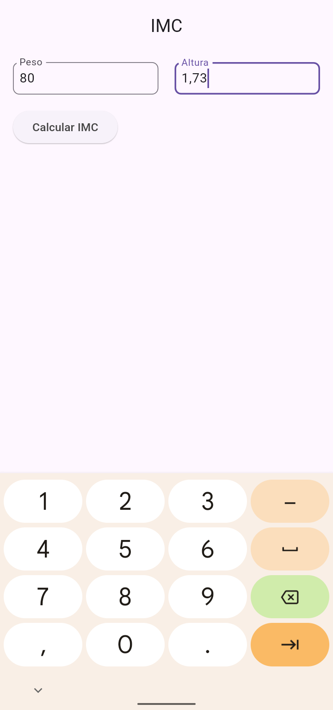
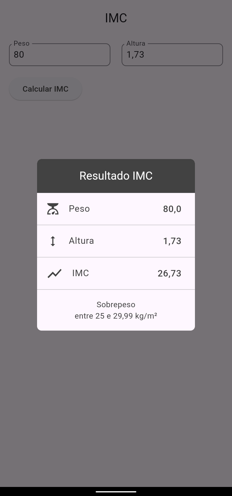
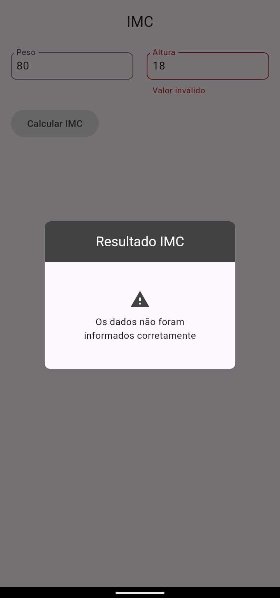

# IMC - Índice de Massa Corporal

Este repositório contém um aplicativo Flutter para calcular o Índice de Massa Corporal (IMC). O IMC é uma medida de peso corporal em relação à altura e é usado para avaliar o risco de obesidade e outras condições relacionadas ao peso.

### Funcionalidades

* Interface de usuário simples e intuitiva para inserir peso e altura.
* Cálculo automático do IMC com base nos valores inseridos.
* Exibição do resultado do IMC com a classificação correspondente (abaixo do peso, normal, sobrepeso e obesidade).
* Design responsivo que se adapta a diferentes tamanhos de tela.

### Tecnologias

* Flutter: framework de desenvolvimento de interface de usuário multiplataforma para criar aplicativos móveis e desktop com Dart.
* Dart: linguagem de programação orientada a objetos usada para desenvolver aplicativos Flutter.

### Pré-requisitos

* Para executar este aplicativo, você precisará ter o Flutter instalado em seu computador. Você pode encontrar instruções de instalação em [https://flutter.dev/docs/get-started/install](https://flutter.dev/docs/get-started/install).

### Como usar

1. Clone este repositório em seu computador.
```sh
git clone https://github.com/mateusheberle/imc-flutter.git
```
2. Abra o projeto no Android Studio ou em seu editor de código preferido.
3. Execute o aplicativo no simulador ou em um dispositivo real.
4. Insira seu peso e altura e toque no botão "Calcular IMC".
5. O aplicativo exibirá seu IMC e a classificação correspondente.

### Contribuições

São bem-vindas contribuições para este projeto. Se você tiver alguma sugestão ou melhoria, por favor, envie um pull request.


### Imagens

<p align="center">
  
  
  
  
</p>